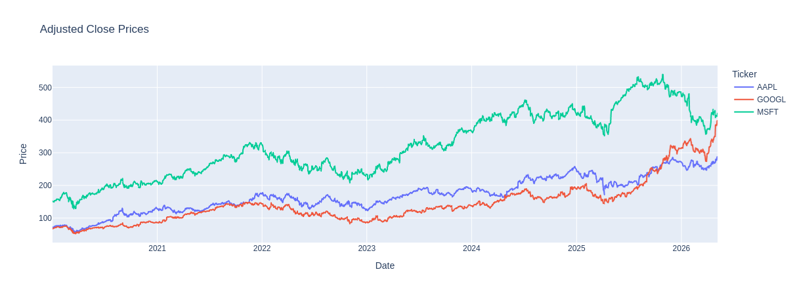
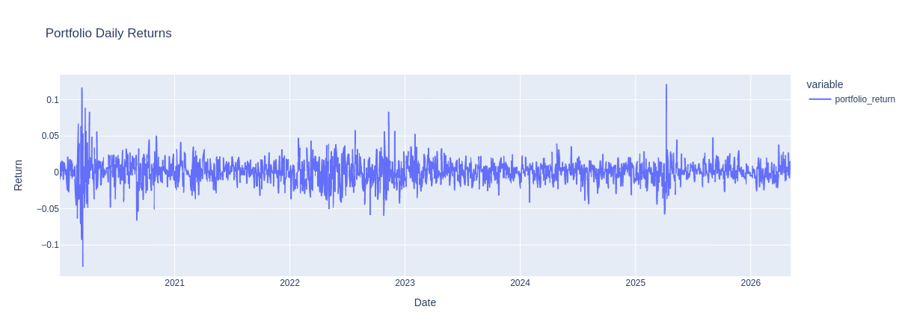
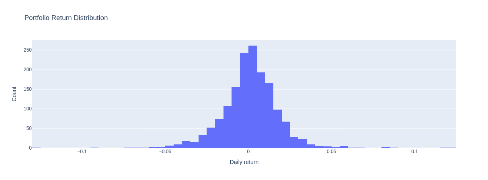
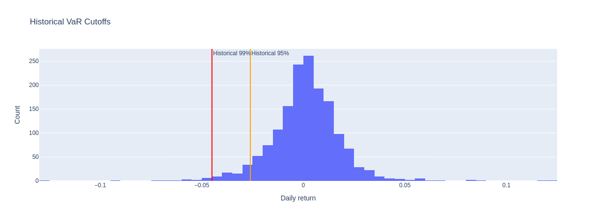
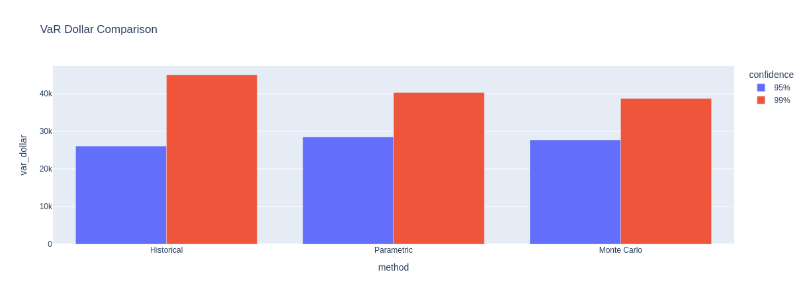
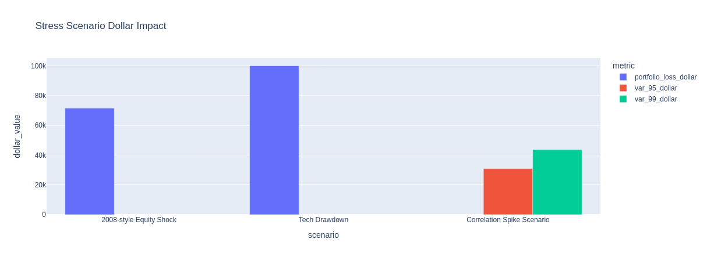
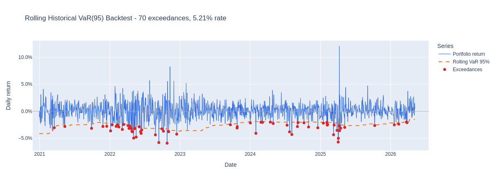

# Portfolio VaR Engine

Notebook-first Python project for portfolio Value at Risk, stress testing, and rolling VaR breach backtesting.

## About

This project analyzes a three-stock equity portfolio using historical market data. It calculates daily returns, estimates portfolio VaR with Historical, Parametric, and Monte Carlo methods, runs simple stress scenarios, and checks VaR breaches with a rolling backtest. The main workflow lives in `portfolio_var_analysis.ipynb` and renders the results as notebook tables and charts.

## Requirements

- Python 3.12 or compatible Python 3.x
- Internet access for Yahoo Finance data through `yfinance`
- Jupyter-capable editor, such as VS Code, JupyterLab, or classic Jupyter Notebook

## Setup

From the repository root:

```bash
python -m venv .venv
.venv/bin/pip install -r requirements.txt
```

If you use VS Code, select the `.venv` interpreter/kernel for the notebook.

## Run The Notebook

Open:

```text
portfolio_var_analysis.ipynb
```

Then run all cells from top to bottom.

The notebook performs this workflow:

1. Configure tickers, weights, portfolio value, and start date.
2. Fetch adjusted close prices from Yahoo Finance.
3. Save prices to `prices.csv`.
4. Calculate daily stock returns.
5. Calculate weighted daily portfolio returns.
6. Save returns to `returns.csv` and `portfolio_returns.csv`.
7. Calculate Historical VaR at 95% and 99%.
8. Calculate Parametric VaR at 95% and 99%.
9. Calculate Monte Carlo VaR at 95% and 99%.
10. Run stress scenarios.
11. Run a rolling 250-day historical VaR breach backtest.
12. Display summary tables and Plotly charts.

## Optional CLI Check

`main.py` mirrors the notebook pipeline without charts. Use it as a quick smoke test:

```bash
.venv/bin/python main.py
```

This command fetches current market data, writes the generated CSV files, and prints summary VaR/backtest results.

## Generated Files

The notebook and CLI can create these local outputs:

- `prices.csv`
- `returns.csv`
- `portfolio_returns.csv`

These files are ignored by git because they are generated from live market data.

## Plots And Interpretation

### Adjusted Close Prices



**What it shows:** adjusted close price history for AAPL, GOOGL, and MSFT.

**How to interpret:** this plot gives context for the risk period. Large trend moves, drawdowns, and high-volatility periods explain why VaR estimates change. Price levels are not directly used for VaR after returns are calculated, but they help sanity-check the data.

### Portfolio Daily Returns



**What it shows:** one time series of weighted daily portfolio returns.

**How to interpret:** this is the main input to Historical VaR and rolling backtest. Sharp negative spikes are loss days. Dense noisy periods indicate higher realized volatility.

### Portfolio Return Distribution



**What it shows:** histogram of portfolio daily returns.

**How to interpret:** this shows how daily portfolio returns are distributed. A wider distribution means higher volatility. The left side is most important for risk because it represents loss days.

### Historical VaR Cutoffs



**What it shows:** histogram of portfolio daily returns with 95% and 99% Historical VaR cutoff lines.

**How to interpret:** VaR lives in the left tail. The 95% cutoff means about 5% of days were worse. The 99% cutoff is farther left because only about 1% of days were worse. If the left tail is fat, losses can be much worse than normal assumptions suggest.

### VaR Method Comparison



**What it shows:** dollar VaR from Historical, Parametric, and Monte Carlo methods at 95% and 99%.

**How to interpret:** 99% VaR should be larger than 95% VaR. Differences across methods come from assumptions: Historical uses empirical returns, Parametric assumes normal returns, and Monte Carlo simulates returns from historical mean/covariance.

### Stress Scenario Dollar Impact



**What it shows:** dollar losses for direct shock scenarios and stressed VaR for the correlation spike scenario.

**How to interpret:** direct shocks answer “what if this one-day market move happens?” Correlation spike answers “what if diversification weakens and stocks move together?” Larger bars mean larger portfolio risk under that scenario.

### Rolling VaR Breach Backtest



**What it shows:** realized portfolio returns, rolling 250-day Historical VaR(95), and breach/exceedance points.

**How to interpret:** a breach happens when realized return falls below the rolling VaR cutoff. Expected exceedance rate for 95% VaR is about 5%. If realized exceedance rate is much higher than 5%, VaR may underestimate tail risk. If much lower, VaR may be conservative.

## Project Structure

- `portfolio_var_analysis.ipynb`: primary notebook workflow with tables and charts.
- `main.py`: CLI mirror of the notebook pipeline.
- `services/data_fetch/`: adjusted close price fetching, validation, and price CSV IO.
- `services/returns/`: stock return and portfolio return calculations.
- `services/var/`: Historical, Parametric, and Monte Carlo VaR services.
- `services/scenarios/`: stress scenario interface and implementations.
- `services/backtesting/`: rolling VaR breach backtest service.
- `requirements.txt`: Python dependencies.
- `codex.md`: repository navigation and design instructions.
